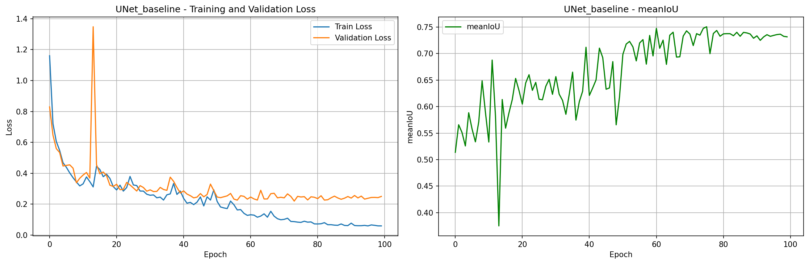
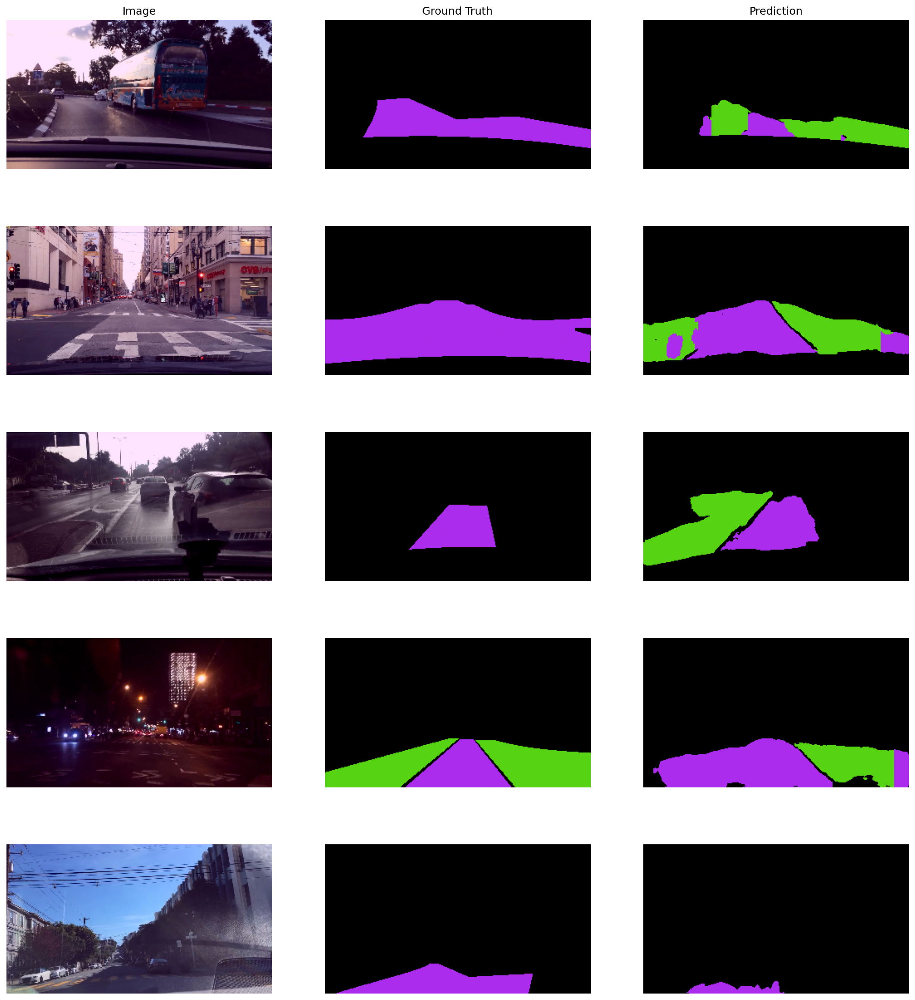

# UNet Drivable Area Segmentation for Autonomous Driving

[](https://www.python.org/downloads/)
[](https://pytorch.org/)
[](https://opensource.org/licenses/MIT)

This project implements drivable area segmentation using the U-Net architecture on the BDD100K dataset. The model identifies three key areas in driving scenes: **ego lane** (direct drivable area), **adjacent lanes** (alternative drivable areas), and **background** (non-drivable areas).


*U-Net Architecture - Original paper by Ronneberger et al.*

---

## Dataset

**BDD100K Drivable Area Segmentation (3 Classes)**

The dataset is automatically downloaded from Google Drive when you run the training script for the first time.

- **Dataset Source**: Pre-processed BDD100K drivable area data (180x320 resolution)
- **Google Drive ID**: `1sX6kHxpYoEICMTfjxxhK9lTW3B7OUxql`
- **Size**: ~100MB (compressed)

### Class Definitions:

| Class ID | Category | Color (RGB) | Description |
|----------|----------|-------------|-------------|
| 0 | direct | (171, 44, 236) | Current/ego lane - the lane the vehicle is driving in |
| 1 | alternative | (86, 211, 19) | Adjacent/alternative lanes - other drivable lanes |
| 2 | background | (0, 0, 0) | Non-drivable areas - sidewalks, buildings, etc. |

This 3-class approach is essential for:
- Lane keeping assistance systems
- Autonomous navigation and path planning
- Drivable area detection for ADAS
- Real-time decision making in autonomous vehicles

---

## Results & Performance

### Training Statistics (100 Epochs)

| Metric | Value |
|--------|-------|
| **Best Mean IoU** | **75.07%** |
| **Best Validation Loss** | 0.2200 |
| **Final Training Loss** | 0.0594 |
| **Training Time** | ~2 hours (RTX 3060) |
| **Inference Speed** | 30+ FPS (GPU) |

### Training Curves



The model demonstrates excellent convergence with steady decrease in training and validation loss, consistent improvement in mean IoU metric, and no overfitting observed (validation tracks training).

---

## Prediction Examples



The model accurately segments:
- **Magenta regions**: Ego lane (safe to drive straight)
- **Green regions**: Adjacent lanes (safe for lane changes)
- **Black regions**: Non-drivable areas (obstacles, sidewalks, buildings)

---

## Video Inference Demonstrations

The model performs real-time segmentation on various driving scenarios:

### Highway Driving


### Residential Area


### Campus Environment


#### Difficult Conditions


---

## Model Architecture

### U-Net Implementation Details

The U-Net architecture consists of:

**Encoder (Contracting Path)**
- 4 downsampling blocks with max pooling
- Layer channels: [64, 128, 256, 512]
- Each block: 2× (Conv2D → BatchNorm → ReLU)

**Bottleneck**
- Double convolution at lowest resolution
- 1024 channels for maximum feature extraction

**Decoder (Expanding Path)**
- 4 upsampling blocks with skip connections
- Transposed convolutions for spatial resolution recovery
- Feature fusion via concatenation with encoder outputs

**Output Layer**
- 1×1 convolution for 3-class pixel-wise classification
- **Total Parameters**: 31,037,763

### Training Configuration

```python
Loss Function: Dice Loss (multiclass)
Optimizer: Adam
Learning Rate: 3e-4 (OneCycleLR scheduler)
Batch Size: 8
Input Resolution: 180×320×3
Output Classes: 3
Data Split: 70% train, 20% val, 10% test
```

---

## Quick Start

### Prerequisites
- Python 3.8+
- CUDA-capable GPU (recommended for training)
- 8GB+ RAM
- 2GB+ disk space

### Installation

1. **Clone the repository**
```bash
git clone https://github.com/Mark-Moawad/UNet-Drivable-Area-Segmentation.git
cd UNet-Drivable-Area-Segmentation
```

2. **Create virtual environment**
```bash
python -m venv venv
source venv/bin/activate  # On Windows: venv\Scripts\activate
```

3. **Install dependencies**
```bash
pip install -r requirements.txt
```

The dataset (BDD100K drivable area subset) will be automatically downloaded on first run.

---

## Usage

### Training from Scratch

```bash
python unet_segmentation.py
```

The script automatically:
1. Downloads and extracts the BDD100K dataset (3,430 images)
2. Splits data into train/val/test sets
3. Trains the U-Net model with threshold-based early stopping
4. Saves the best model checkpoint
5. Generates training curves and prediction visualizations

### Video Inference

To run inference on your own driving videos:

1. **Enable video processing** in `unet_segmentation.py`:
```python
process_videos_flag = True
```

2. **Place videos** in `data/dataset/testing/`

3. **Run inference**:
```bash
python unet_segmentation.py
```

Output videos with overlaid segmentation masks will be saved to `data/processed/`.

## Project Structure

```
UNet-Drivable-Area-Segmentation/
├── unet_segmentation.py          # Main training & inference pipeline
├── utils.py                       # Utility functions (metrics, visualization)
├── requirements.txt               # Python dependencies
├── README.md                      # This file
│
├── data/
│   ├── dataset/                   # BDD100K dataset (auto-downloaded)
│   │   ├── image_180_320.npy     # Pre-processed images (3,430 samples)
│   │   ├── label_180_320.npy     # Segmentation labels
│   │   └── testing/              # Test videos for inference
│   ├── models/                    # Trained model checkpoints
│   │   ├── UNet_baseline.pt      # Best model weights
│   │   └── UNet_baseline_training_stats.csv
│   ├── outputs/                   # Training visualizations
│   │   ├── UNet_baseline_training_curves.png
│   │   └── UNet_baseline_predictions.png
│   ├── processed/                 # Inference output videos
│
├── media/                         # Photos and demo videos for README
│
└── venv/                          # Python virtual environment
```
---

## References

- **U-Net Paper**: [Convolutional Networks for Biomedical Image Segmentation](https://arxiv.org/abs/1505.04597) (Ronneberger et al., 2015)
- **BDD100K Dataset**: [A Diverse Driving Video Database](https://arxiv.org/abs/1805.04687) (Yu et al., 2018)
- **Berkeley DeepDrive**: [Official Website](https://bdd-data.berkeley.edu/)

---

## License

This project is licensed under the MIT License - see the [LICENSE](LICENSE) file for details.

---

## Author

**Mark Moawad**  
*Perception Engineer | Computer Vision Specialist*

This project demonstrates practical computer vision and deep learning skills for autonomous driving applications, showcasing end-to-end development from model training to production-ready inference.

---

## Acknowledgments

- Original U-Net architecture by Ronneberger, Fischer, and Brox
- BDD100K dataset team at UC Berkeley
- PyTorch and segmentation_models_pytorch communities
---

## Contact

For questions, collaboration opportunities, or professional inquiries:
- GitHub: [@Mark-Moawad](https://github.com/Mark-Moawad)
- Email: [mark.moawad96@gmail.com](mark.moawad96@gmail.com)
- LinkedIn: [https://www.linkedin.com/in/markmoawad96/](https://www.linkedin.com/in/markmoawad96/)

